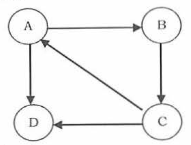
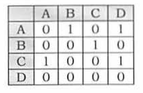

## DataStructure: Graph

### Graph Declaration for Adjacency Matrix

Components to declare a graph in adjacency matrix:
1) the number of vertices
2) the number of edge  
3) interconnections

Below codes are given basic components for declaration of adjacency matrix. Annotations are thoughts or questions from reading the code.

```python
    class Vertex:
        def _init_(self, node):
            self.id = node
            self.visited = False
            
        def addNeighbor(self, neighbor, G): // Q: what is G?, A: might be Graph, graph will draw edge from current node to neighbor node.
            G.addEdge(self.idm neighbor)    // might be implemented in Graph
            
        def getConnections(self, G):
            return G.adjMatrix[self.id]     // might be implemented in Graph
    
    class Graph:
        def _init_(self, numVertices, cost = 0):
            self.adjMatrix = [[-1] * numVertices for _ in range(numVertices)] // declaration of adjacency matrix
            self.numVertices = numVertices
            self.vertices = []      // declaration of a list of vertices, Q: but for what?
            for i in range(0, numVertices): 
                newVertex = Vertex(i)   // create vertex 
                self.vertices.append(newVertex) // append newly created vertex into a list
```
#### Description

In adjacency matrix method, we use a matrix with size ```V x V```.   
The values of matrix are ```boolean```.   
Let us assume the matrix is ```Adj```. The value ```Adj[u,v]``` is set to 1 if there is an edge from `vertex u` to `vertex v` and 0 otherwise.   
We assume that there is an "edge" from each vertex to itself. So, `Adj[u,u]` is set to 1 for all vertices.

If graph is a directed graph then we only mark one entry in the adjacency matrix.   
For instance:



The above graph can be given as:


